# Tarheta

Tarheta is a powerful web application designed for both students and teachers to make learning more engaging and efficient. With Tarheta, users can create flashcards for quizzes, exams, and reviewers, allowing them to review and reinforce key concepts in an interactive and enjoyable way. For teachers, Tarheta also provides the option to create classes, enabling them to organize simultaneous tests and quiz-taking for their students. Additionally, the application offers several flashcard organization features and a real-time notification system, ensuring that users never miss an important update or deadline. Built using the CodeIgniter 3 framework and MySQL for the database, Tarheta is a robust and reliable tool for enhancing learning outcomes.

# Functionality

- **Flashcard System:** Questions are presented as flashcards.

    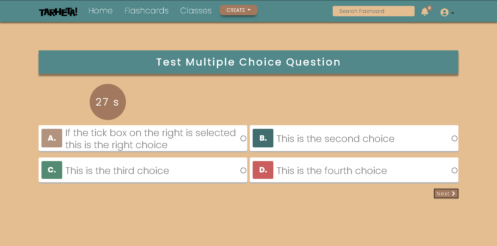

    - Users can choose between different types of questions, time for each question and score.

        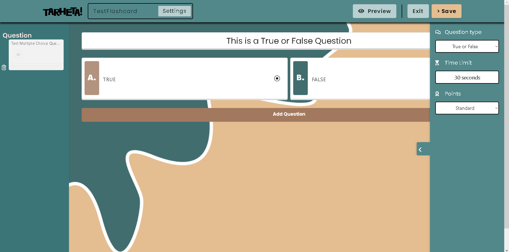
        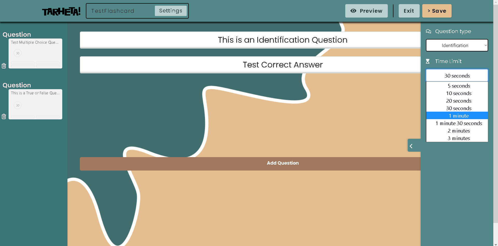
    
    - After finishing answering the user can view their statistic.
    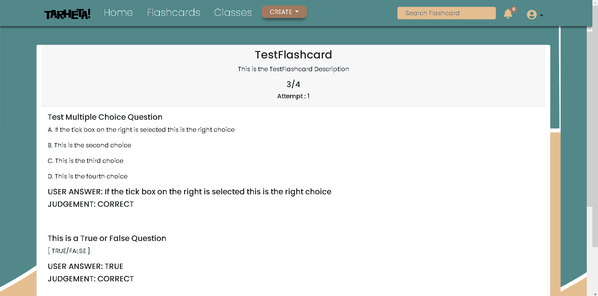

- **Class System:** Teachers can create classes in order to group Students to easily assign flashcards.

    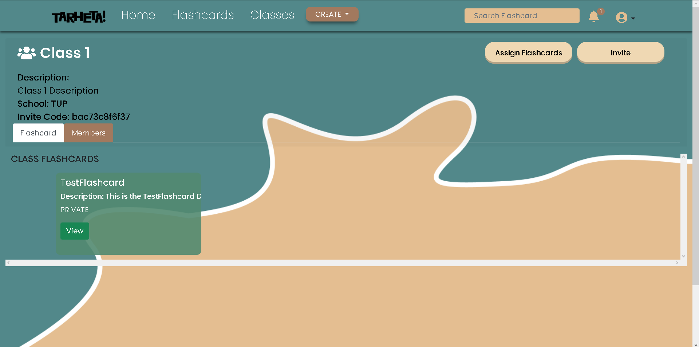

    - Teachers can invite Students directly via the user's email.

        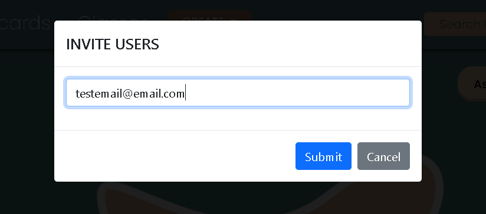
    
    - Or Students can join via the given Class Code.

        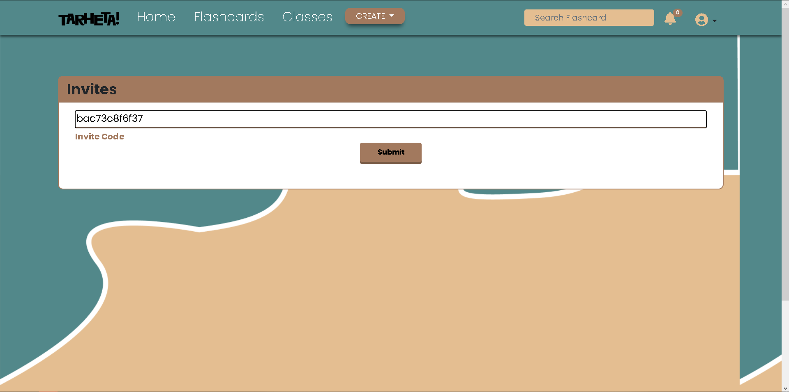

- **Realtime Notifications:** Users are notified about events relating to their accounts.
    
    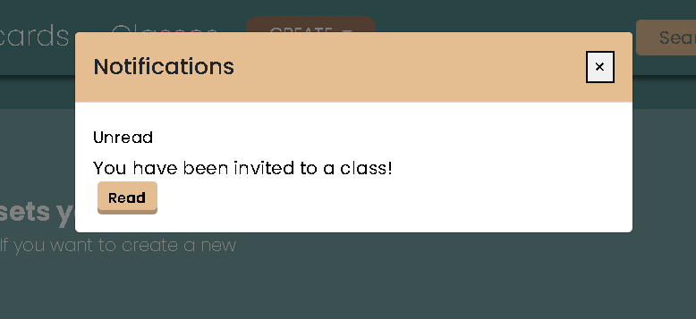
    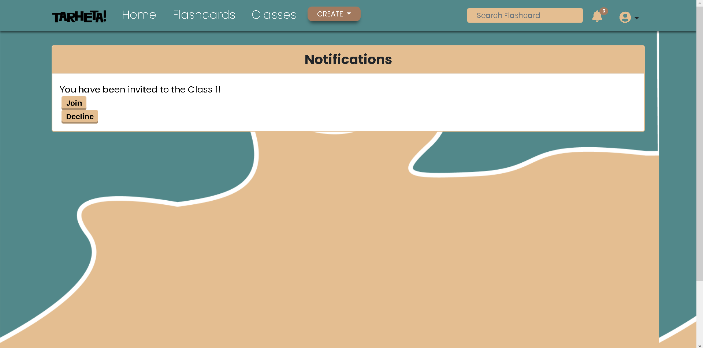

- **Flashcard Organization:** Flashcards can be grouped and viewed via Subject, Visibility and Sets.

    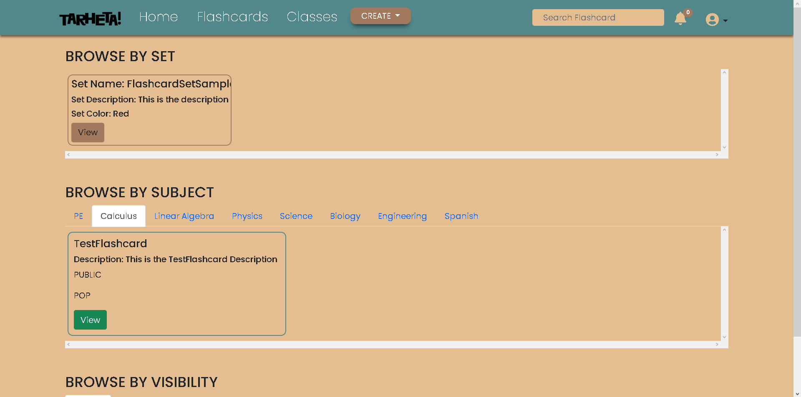

    - Users can create flashcard Sets to further group desired flashcards.
    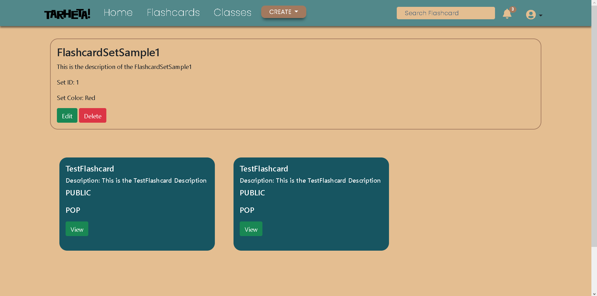

- **User Profile Personalization:** User can set relevant information in order to distinguish themselves.

    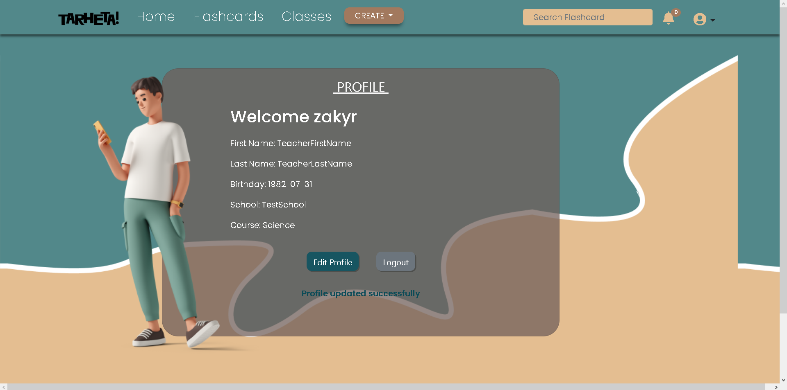
    
# Requirements
- [XAMPP](https://www.apachefriends.org)
- [RCAPTCHA](https://www.google.com/recaptcha/about/) site key and secret key
- Email and it's password for the .env file

# Installation

1. Clone this repository.
2. Import the sql file from the schema folder.
3. Edit the **.env** file by providing the required details.
####
    EMAIL = ""
    EMAIL_PASSWORD = ""
    RCAPTCHA_SITE_KEY = ""
    RCAPTCHA_SECRET_KEY = ""

4. Edit the config.php  base_url with your desired localhost link.
#### Sample:
    $config['base_url'] = 'http://localhost/tarheta/';

5. Edit the database.php by placing the name of the XAMPP database.
#####
    'username' => 'root',
	'password' => '',
	'database' => 'databaseNameHere',
6. Run **XAMPP** control panel with **Apache** and **MySQL** services running.
7. Access the application with the link given in step number 4.